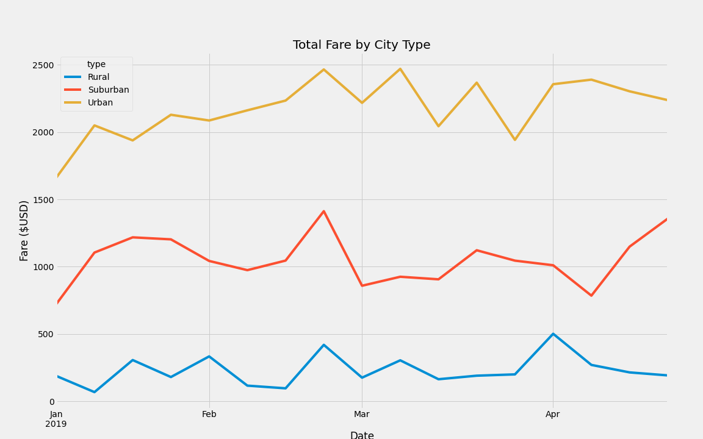

# PyBer_Analysis

## Overview of the analysis: 
Create a summary DataFrame of the ride-sharing data by city type. Then, using Pandas and Matplotlib, you’ll create a multiple-line graph that shows the total weekly fares for each city type. The results will provide an analysis of the differences in ride-sharing data among the different city types.

## Results: 
Urban has the highest amount of Total Rides (1,625) and Total Drivers (2,405), with the lowest averages for Fare per Ride ($24.53) and Fare per Driver ($16.57). Rural had the lowest amount of Total Rides (125) and Total Drivers (78), with the highest averages for Fare per Ride ($34.62) and Fare per Driver ($55.49). Suburban city type had Total Rides (625) and Total Drivers (490), with an averages for Fare per Ride ($30.97) and Fare per Driver ($39.50). 

With the Total Fare by City Type chart below, the results can be further analyzed to show the fare for each city type by week. As we can see in the chart below, all city types had a spike in February.

## Summary:
Three business recommendations to the CEO for addressing any disparities among the city types:
- Create a program to recruit new drivers in Rural and Suburban cities
- Once rural and suburban cities have more drivers, create an incentive program to get more riders.
- Create an incentive program (ex. provide a promotion code) for Urban city Riders to get more riders. The number of Total Rides is significantly lower compared to the amount of Total Drivers
